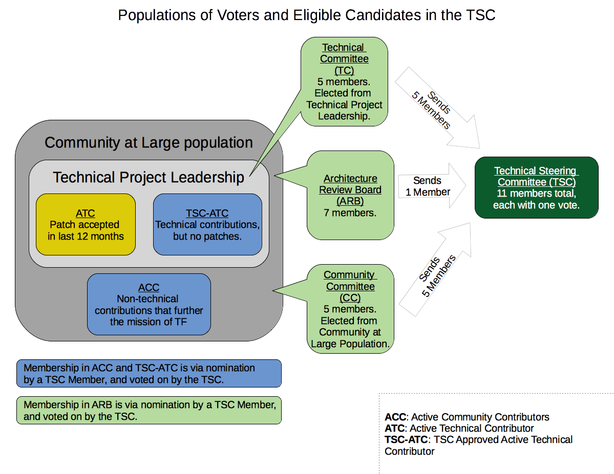

# Tungsten Fabric Governance

## Governance Documents

* [Technical Charter](./TungstenFabricProjectTechnicalCharter.rst): The founding document for Tungsten Fabric.
* [Community Governance Document](./TungstenFabricCommunityGovernance.rst): A detailed description of the governance of Tungsten Fabric.

## Current Committee Membership

* [Architecture Review Board](./ArchitectureReviewBoard/ARB_Members)
* [Community Committee](./CommunityCommittee/CC_Members)
* [Technical Committee](./TechnicalCommittee/TC_Members)
* [Active Community Contributors](./ACC_Members)
* [TSC Approved Active Technical Contributors](./TSC-ATC_Members)

## Elections

The [Election Mechanics](https://wiki.tungsten.io/display/TUN/Election+Mechanics) wiki page supplements the Charter and Governance Document with specific details such as tools, timelines and exact process details. Changes to this page must be approved by the TSC, but should not contradict anything in either the Charter or Governance Document.

## Overview of the Tungsten Fabric Community and Governance Groups

All of these things are visualised in [this diagram](./TSCVotersAndCandidates/TSCVotersAndCandidates-diagram.png):

 

### The basic groups in the TF community

* **Community At Large**: All TF users and contributors.
* **Active Technical Contributors (ATC)**: People who have had a patch merged within the past 12 months. Defined in [Sections 3.2 and 5.2.3.2.3](./TungstenFabricCommunityGovernance.rst) of the Community Governance document.
* **Technical Steering Committee Approved Active Technical Contributors (TSC-ATC)**: People who have made technical contributions (participated in architectural discussions, for instance), but who have not had a patch merged. Defined in [Section 5.2.4.2.1](./TungstenFabricCommunityGovernance.rst) of the Community Governance document.
* **Active Community Contributors (ACC)**: People who have made non-technical contributions that further the mission of TF. Defined in [Section 5.2.4.2.3](./TungstenFabricCommunityGovernance.rst) of the Community Governance document.

### Groups directly involved in TF governance

* **Technical Project Leadership**: ATC + TSC-ATC.
* **Technical Committee (TC)**: An elected standing committee of TF composed of 5 people elected out of the Technical Project Leadership. These people also are members of the Technical Steering Committee (TSC; see below). Defined in [Section 5.2.2](./TungstenFabricCommunityGovernance.rst) of the Community Governance document.
* **Community Committee (CC)**: An elected standing committee of TF composed of 5 people elected out of the Community At Large. These people also are members of the Technical Steering Committee (TSC; see below). Defined in [Section 5.2.2](./TungstenFabricCommunityGovernance.rst) of the Community Governance document.
* **Architecture Review Board (ARB)**: A nominated and TSC-confirmed standing committee of TF composed of 7 people from the Community At Large. Defined in [Section 5.2.2](./TungstenFabricCommunityGovernance.rst) of the Community Governance document.
* **Technical Steering Committee (TSC)**: Overall leadership for the TF project. Composed of the entirety of the TC and CC plus one member of the ARB. Defined further in [Section 2](./TungstenFabricProjectTechnicalCharter.rst) of the Technical Charter and [Section 5](./TungstenFabricCommunityGovernance.rst) of the Community Governance document.

### Other roles

* **Project Technical Lead (PTL)**: The leader and spokesperson for a sub-project of TF. This is an elected postion. The PTL for a project is likely to be on the TSC or the ARB, but this is not a requirement of the position.
* **Voting community member**: In order to vote in TF elections, a person must be in the ATC, TSC-ATC, or ACC, which is to say, they must be recognised as a contributing member of the community. This is defined in [Section 5.2.4.3](./TungstenFabricCommunityGovernance.rst) of the Community Governance document.

## Acronym Reference

Yes, there are a lot of them. We've collected them here for ease of reference.

* ACC: Active Community Contributor
* ARB: Architecture Review Board
* ATC: Active Tecnical Contributor
* CC: Community Committee
* PTL: Project Technical Lead
* TC: Technical Committee
* TSC: Technical Steering Committee
* TSC-ATC: Technical Steering Committee approved Active Technical Contributor
